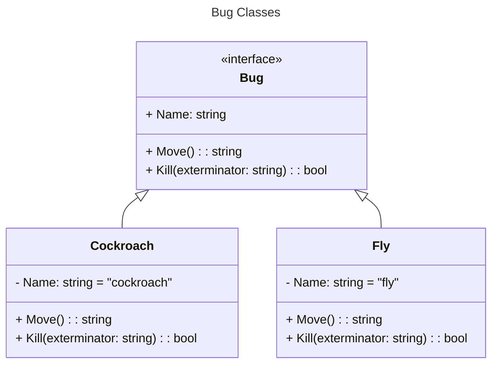

# Factory Method Design Pattern Example

Write a bug killing game in which you have to use the right method to kill different kinds of bugs. Bugs are created randomly.

### Code

GitHub repository: https://github.com/ProfBird/CS246_DebuggingGame

### Class Diagram

