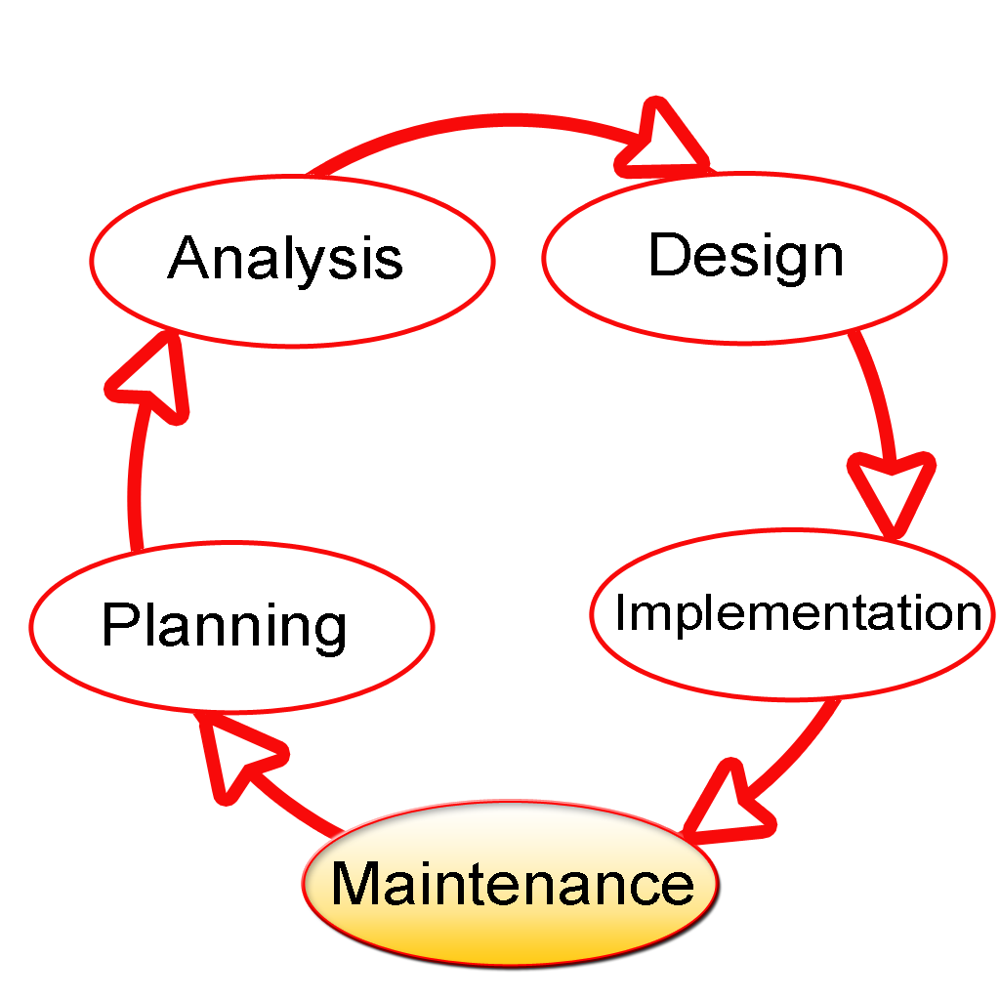
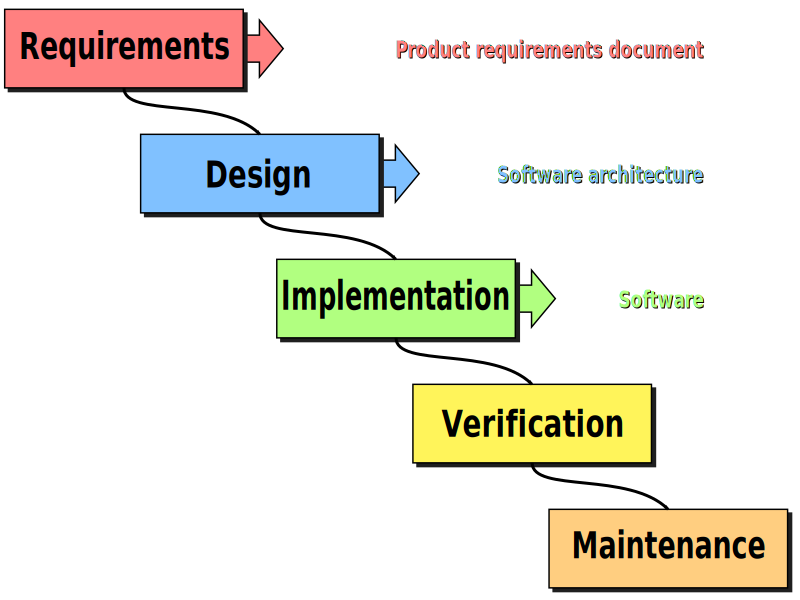
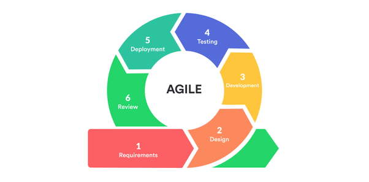
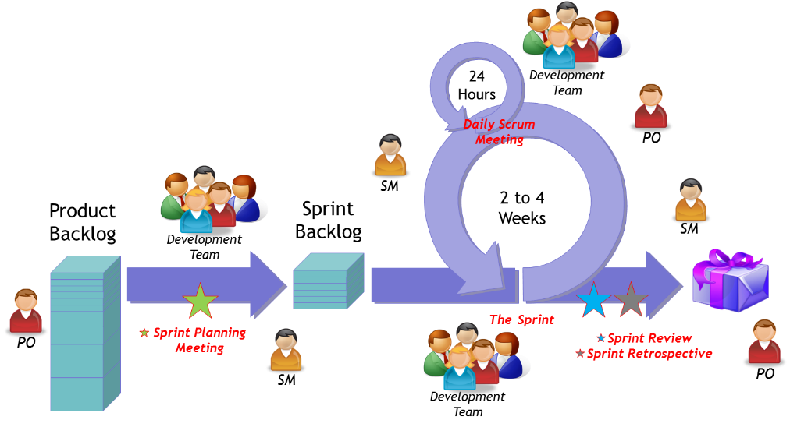
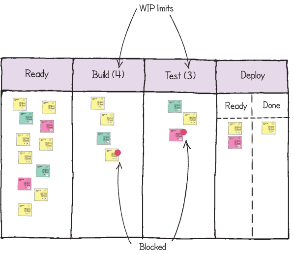

# Approaches to Software Development

**CS246N System Design**

[TOC]

## The SDLC&mdash;Software Development Lifecycle

Successful software doesn't stop being developed after the first *release to production*. It will continue to be developed, with bug fixes, security patches, and new features being added.

 

[SDLC diagram by Dzonatas - Own work, CC BY-SA 3.0

1. Planning: A software project is proposed, and a plan is made for developing it.
2. Analysis: Requirements are written that define what the software will do for the end users.
3. Design: Decisions are made about technology and architecture of the software.
4. Implementation: Developers write the software and test it.
5. Maintenance: Bug fixes, security patches, and customer support.

## Software Development Processes

### Waterfall

[Diagram by Peter Kemp / Paul Smith](https://commons.wikimedia.org/w/index.php?curid=10633070) Adapted from Paul Smith&#039;s work at wikipedia, CC BY 3.0

Notes: 

- A planning step would precede design.
- This steps would be executed one after another to produce the first version of the software&mdash; *production release* would happen after verification

### Agile

Agile is a philosophy, not a process. The key idea behind *agile software development* is that it is an adaptive, iterative process in which:

- Developers deliver partially implemented, working software to users through the development process.
- End users give feedback to the developers throughout the process.

#### Scrum

This is the most popular agile methodology. It focuses on learning from the iterative development process to continually improve the way the development team works, and the software being developed.

*Scrum framework ([Source](https://www.axelos.com/store/book/prince2-agile))*

#### Kanban

This is a process that originated in the auto manufacturing industry (at Toyota) as a way to manage work in process through visualization. The *kanban board* is often used in conjunction with the scrum methodology.

*Kanban Board ([Source](https://www.axelos.com/store/book/prince2-agile))*

## References

[Systems Development Lifecycle](https://en.wikipedia.org/wiki/Systems_development_life_cycle)&mdash;Wikipedia

[Software Development Process](https://en.wikipedia.org/wiki/Software_development_process)&mdash;Wikipedia

[Waterfall Model](https://en.wikipedia.org/wiki/Waterfall_model)&mdash;Wikipedia

[Agile 101](https://www.agilealliance.org/agile101/)&mdash;The Agile Alliance

[Scrum vs Kanban: A Comparison of Agile Methodologies](https://www.bmc.com/blogs/scrum-vs-kanban/)&mdash;BMC Blogs

------

System Design Lecture Notes by [Brian Bird](https://profbird.dev), 2021, are licensed under a [Creative Commons Attribution 4.0 International License](http://creativecommons.org/licenses/by/4.0/).

------

