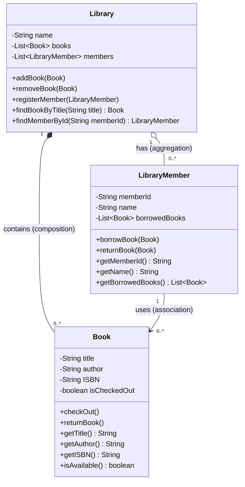

# OO Analysis and Design with UML

**CS246N System Design**

[TOC]

## Introduction

In this session, we will review Object Oriented Programming concepts for designing software solutions. I'm assuming that most of this is review from your C# or C++ programming classes.

Now, in the age of generative AI, it is more important than ever for developers to learn design skills, since AI is getting better and better at coding, but isn't very good at software design (yet?).

## Frameworks, Libraries, and Custom Solutions

First we're going to talk about frameworks and libraries because when we use those we get pre-fabricated OO designs. We don't have to do any design to use them, but we should understand their design.

- What is a library? Give examples.

- What is a framework? Give examples.

- Do you think there be times when you need to write custom code for functionality not provided by your framework or library?

## OOP Terminology

What is a *class*?

What is a *method* (aka *function*)?

What is a *field* of a class (aka i*nstance variable* or *member variable*)?

What is a *static class*?

What is an *object*?

## OO Design

When we design a set of classes to model a solution to a problem, how do we decide what those classes should be? One approach is to start with a written description. In that description:
- What will nouns become?
- What will verbs become?
- Do we represent <u>all</u> the nouns and verbs in our class design?
- How do we determine which instance variables (aka fields) and methods go on which classes?

### Exercise

Find the classes, fields, and methods you would use to create an object oriented UML class diagram based on this [Tip of the Day web site description](TipOfTheDayDescription.html).

### The three primary OOP relationships

- What are the names and meanings of these relationships?
- What are examples in C#?

## Unified Modeling Language

UML (Unified Modeling Language) is a way to visually represent a software design that is independent of any particular computer language. There are [fourteen types of UML diagrams](https://creately.com/blog/diagrams/uml-diagram-types-examples/). We will just be using [UML class diagrams](https://en.wikipedia.org/wiki/Class_diagram).

- Representing classes

  - Class name (singular)

  - Fields

    - Access modifiers

      &plus; public: can be accessed from outside the class

      &num; protected: can be accessed inside the class and in inherited classes

      &minus; private: can only be accessed inside the class

  - Methods

  

- Representing relationships

  - Association: arrow
  - Aggregation (might be equivalent to association): open diamond.
  - Composition: black diamond.
  - Inheritance: triangle.

- 
  Cardinality (multiplicity)
  
  (In UMLet, m1 indicates the end of the line with the diamond or arrow and m2 indicates the other end.)
  
  - Ranges: indicate a range with two dots. For example: 0..n
  - Cardinality relationships
    - One-to-one: put 1 at the end with the diamond.
    - One-to-many: put 1..n at the end with the diamond&mdash;meaning the class with the diamond can have 1 to many instances of the other object.
    - Many-to-many: put diamonds on both ends of the line and put 1..n on both ends. It is good to avoid this relationship since it adds extra complexity.
  

### Library Example

This class diagram is for a set of classes that model a library. The library has books and members. The members can check out and return books. 

*This library class diagram was made using [Mermaid](https://mermaid.js.org/). The first draft of the Mermaid code was generated by AI using the DeepSeek R1 model.*

### Exercise

Draw a UML diagram to model the classes in the Tip of the Day solution using the cross-platform UML drawing program, [UMLet](https://www.umlet.com).

#### UMLet UML Diagramming Tool

This is a visual tool for drawing any of the 14 UML diagrams. It can be used online in a browser or downloaded and run on a computer. It requires Java. **Warning**: if you don't have Java installed on your computer, it will ask you to install Java version 1.6 (Java 6)&mdash;**don't** do that! Install the latest version of Java instead (as of 1/1/2025 that's Java 23).

## Tip of the Day Example

[Tip of the Day class diagram](Images/TipOfTheDayDomainModel2022.pdf)

## Answers

    
<b>Frameworks, Libraries, and Custom Solutions</b>

  <ul>
      <li><b>Library:</b> a collection of pre-written classes that use can use. Examples would be the Math libraries in various programming languages or a third-party JS library like jQuery.</li>
    <li><b>Framework:</b> a pre-fabricated skeleton of an application. I can be built and run without the dev needing to put anything together. It is designed for a dev to add content and functionality to "flesh out" the application. An example would be ASP.NET MVC. (BTW, the creators of React.js insist that React is a library, not a framework.)</li>
    <li><b>Custom code:</b> will often need to be written for functionality not provided by a framework or library. For example, if you want to add a scientific calculator function to an MVC web app, the code for doing the calculations wouldn't really be a model or a controller, you would instead make a custom calculator class.</li>
  </ul> 

  
<b>OOP Terminology</b>

  <ul>
    <li><b>Class:</b> a module that contains variables for storing data and methods for operating on that data. It is a template (or blueprint) for creating objects.
Unless a class is static or has static methods, it's methods are not executable.</li>
    <li><b>Object:</b> executable code that is created from a class. Multiple objects can be created from the same class.</li>
    </ul> 

    
<b>OO Design</b>

  <ul>
    <li><b>Nouns</b> become classes or instance variables (fields of a class).</li>
    <li><b>Verbs</b> become methods.</li>
    <li><b>Instance variables and methods</b> should be on the class to which they apply. Each class should be responsible for managing it's own stuff.</li>
  </ul> 

    
<b>Three primary OOP relationships</b>

  <ul>
    <li><b>Aggregation:</b> the "has-a" relationship.
(<b>Association</b> is the "uses" relationship, but many experts consider aggregation and association to be the same thing. See Martin Fowler,  <a href="https://martinfowler.com/bliki/AggregationAndComposition.html">Aggregation and Composition</a></li>
    <li><b>Composition:</b> the "is-a-part-of" relationship.</li>
    <li><b>Inheritance:</b> the "is-a" relationship.
  </ul>

## References

Bell, Donald. [The UML 2 class diagram](https://developer.ibm.com/articles/the-class-diagram/) IBM, 2004. Tutorial article.

Crawley, Gregory. [UML class diagram arrow types: explanations and examples](https://www.gleek.io/blog/class-diagram-arrows.html) Gleek, 2021. Tutorial article with video.

System Design  Lecture Notes by [Brian Bird](https://profbird.dev), 2018, Revised <time>2025</time>, are licensed under a [Creative Commons Attribution 4.0 International License](http://creativecommons.org/licenses/by/4.0/).

