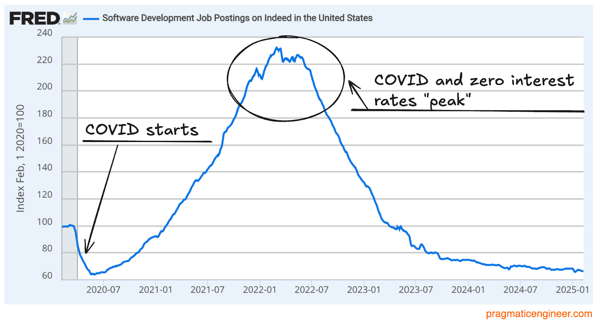
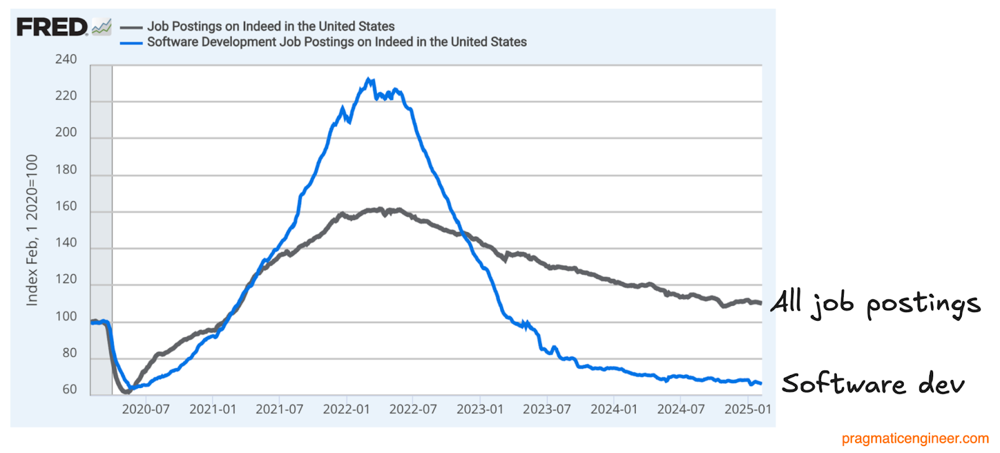
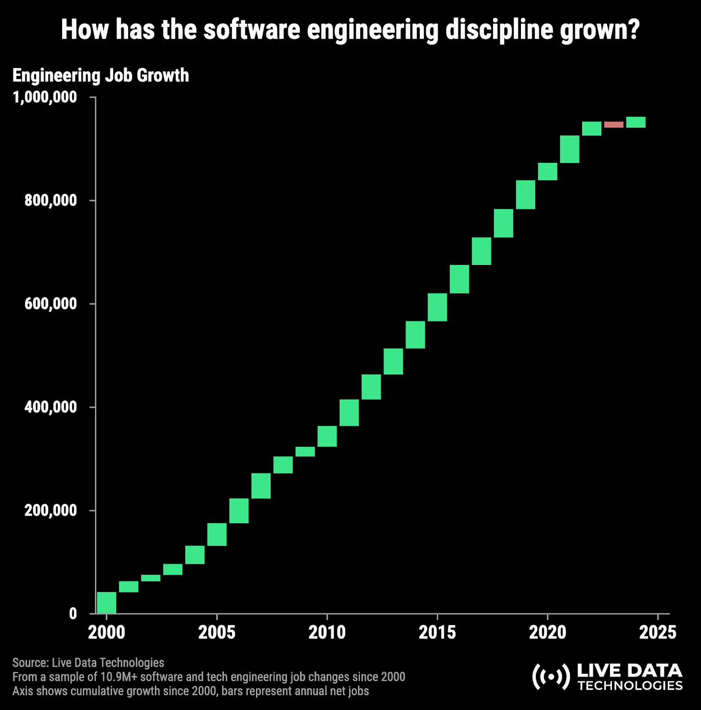

<h1>2025 Software Dev/Engineer Job Market</h1>

**CS246N System Design**

## Effect of the Pandemic on Jobs

## Job Growth 2000 through 2024

## Reference

[Software engineering job openings hit five-year low?](https://newsletter.pragmaticengineer.com/p/software-engineering-job-openings?utm_source=post-email-title&publication_id=458709&post_id=157574990&utm_campaign=email-post-title&isFreemail=true&r=4derd2&triedRedirect=true&utm_medium=email)&mdash;Gergely Oroz, The Pragmatic Engineer, Feb. 20, 2025.

(https://newsletter.pragmaticengineer.com/p/state-of-eng-market-2024?utm_source=substack&utm_medium=email)&mdash;Gergely Oroz, The Pragmatic Engineer, Oct. 22, 2024.

System Design Lecture Notes by [Brian Bird](https://profbird.dev), <time>2025</time>, are licensed under a [Creative Commons Attribution 4.0 International License](http://creativecommons.org/licenses/by/4.0/).
