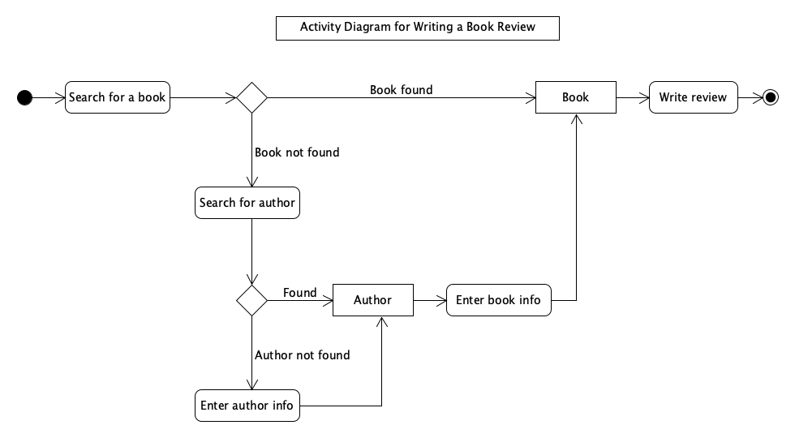

<h1>UML Sequence Diagrams</h1>

**CS246N System Design**

<h2>Contents</h2>

[TOC]

## User Flows for UX Design

Ordinary flow charts or usually used by designers.

Developer's use UML Activity diagrams to describe user activity flows.

## UML Activity Diagrams

## Examples

### Book Review Activity Diagram

## Reference

- [What are User Flows in User Experience (UX) Design?](https://careerfoundry.com/en/blog/ux-design/what-are-user-flows/)

- [UML 2 Tutorial: Activity Diagrams](https://sparxsystems.com/resources/tutorials/uml2/activity-diagram.html)

  

System Design Lecture Notes by [Brian Bird](https://profbird.dev), <time>2023</time>, are licensed under a [Creative Commons Attribution 4.0 International License](http://creativecommons.org/licenses/by/4.0/).
